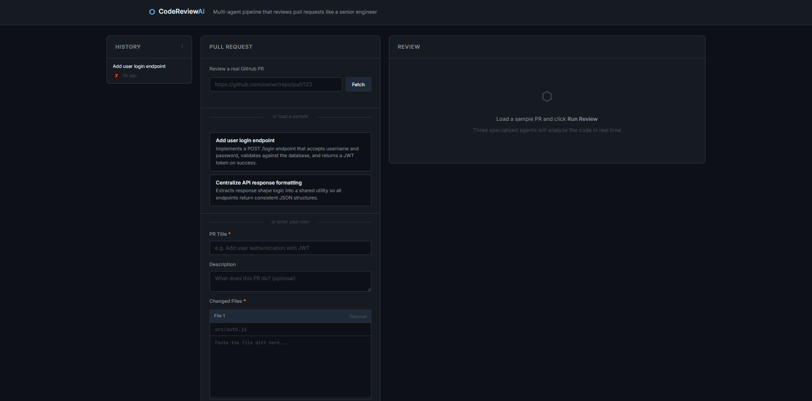

# AI Code Review Pipeline

A multi-agent system that reviews pull requests like a senior engineer. Four specialized AI agents work in a coordinated pipeline — one plans the review, two analyze code in parallel, and one synthesizes a final verdict.

**Live demo:** [ai-code-review-pipeline-production.up.railway.app](https://ai-code-review-pipeline-production.up.railway.app)


<!-- Replace with a real screenshot or screen recording once you have one -->

---

## How it works

```
Pull Request
     │
     ▼
┌─────────────┐
│   Planner   │  Reads the PR, identifies concerns (security, logic, etc.),
│    Agent    │  and decides which files need attention
└──────┬──────┘
       │  review plan
       ▼
┌─────────────┐   ┌─────────────┐
│  Reviewer   │   │  Security   │  Run in parallel per file.
│    Agent    │   │    Agent    │  Reviewer checks logic & quality.
└──────┬──────┘   └──────┬──────┘  Security scans for vulnerabilities.
       │                 │
       └────────┬────────┘
                │  all findings
                ▼
        ┌─────────────┐
        │ Synthesizer │  Merges findings, removes duplicates,
        │    Agent    │  and writes one professional final review
        └──────┬──────┘
               │
               ▼
         Final Review
     (APPROVE / REQUEST CHANGES)
```

Each agent has a focused system prompt and communicates via structured JSON. The orchestrator manages the flow and runs the reviewer + security agents **concurrently** to reduce latency.

---

## Tech stack

- **Runtime:** Node.js (ES modules)
- **Server:** Express with Server-Sent Events for live streaming
- **AI:** [Anthropic Claude API](https://www.anthropic.com) — 4 specialized agents, each making one focused Claude API call
- **Frontend:** Vanilla HTML/CSS/JS — no build step, no framework

---

## Getting started

**Prerequisites:** Node.js 18+, an [Anthropic API key](https://console.anthropic.com)

```bash
git clone https://github.com/YOUR_USERNAME/ai-code-review-pipeline
cd ai-code-review-pipeline
npm install

cp .env.example .env
# Add your ANTHROPIC_API_KEY to .env

npm run dev
# Open http://localhost:3000
```

Two sample PRs are included to demo the pipeline — one contains a SQL injection vulnerability and a hardcoded JWT secret, so you can see the security agent in action.

---

## Project structure

```
src/
  agents/
    planner.js       # Stage 1: analyze PR, produce review plan
    reviewer.js      # Stage 2a: logic, quality, best practices
    security.js      # Stage 2b: vulnerability scanning
    synthesizer.js   # Stage 3: merge findings into final review
  orchestrator.js    # Coordinates the pipeline, handles parallelism
  server.js          # Express server + SSE endpoint
  sample-prs.js      # Demo data

web/
  index.html         # Single-page UI
  css/style.css      # Dark theme, no framework
  js/app.js          # Consumes SSE stream, renders live progress
```

---

## Architecture decisions

**Why parallel agents?**
Running the reviewer and security agent concurrently per file reduces total latency significantly. They read the same input independently and produce different outputs — a natural fit for parallelism.

**Why structured JSON between agents?**
Each agent's output is typed and validated before being passed downstream. This makes the pipeline debuggable and the agents independently testable.

**Why Server-Sent Events instead of polling?**
SSE gives the UI live progress as each stage completes without the overhead of WebSockets. The pipeline takes 15–30 seconds — watching it run in real time is part of the demo.

---

## Roadmap

- [ ] GitHub API integration (review real PRs by URL)
- [ ] Webhook support (auto-trigger on PR open)
- [ ] Per-language specialist agents (Python, SQL, etc.)
- [ ] Review history / persistence
